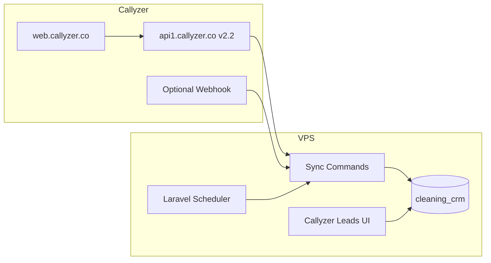

# Callyzer → CRM Integration Plan

**Source dashboard:** [web.callyzer.co](https://web.callyzer.co/dashBoard)  
**API documentation:** [Callyzer API v2.2](https://developers.callyzer.co/)  
**API base URL:** `https://api1.callyzer.co/api/v2.2/`  
**Target CRM:** Cleaning CRM (`crm.launchquests.com`)  
**Git branch:** `callyzer`  
**Last updated:** October 7, 2026  

---

## 1. Goal

| Phase | What |
|-------|------|
| **Now** | Pull **call history** and **leads** from Callyzer into MySQL |
| **History** | One-time backfill of all historical data |
| **Ongoing** | Scheduled delta sync (new/updated records only) |
| **Later** | CRM navigation menu **“Callyzer Leads”** (similar to Leads / WhatsApp / Google Ads) |

**Important:** Callyzer data lives in **dedicated tables** first — not merged into existing CRM `leads` (36K+ records) until mapping and duplicate rules are defined.

---

## 2. Database Strategy

### Use existing database (recommended)

Use the **existing `cleaning_crm` database** and add new prefixed tables. A separate database is **not required**.

```
cleaning_crm (existing)
├── leads, customers, jobs, users, ...   ← existing CRM
├── callyzer_leads                        ← new
├── callyzer_call_logs                    ← new
├── callyzer_sync_cursors                 ← new
└── callyzer_sync_runs                    ← new
```

### Why same database fits this project

| Reason | Detail |
|--------|--------|
| Same VPS MySQL | `cleaning_crm` already runs on `127.0.0.1` — no new DB user or connection |
| Laravel default | One `mysql` connection, standard migrations (same as recruitment module) |
| Easier joins later | Link Callyzer lead → CRM lead by phone/user without cross-DB queries |
| One backup | Single mysqldump covers CRM + Callyzer data |
| Simpler deploy | `php artisan migrate` once on production |

### When a separate database would make sense

| Reason | When it matters |
|--------|-----------------|
| Isolation | Callyzer sync writes very large volume and you want to isolate CRM performance |
| Permissions | Different apps need different DB users |
| Clear boundary | Treating Callyzer as a standalone external data store |

For one Laravel app on one VPS with moderate call/lead volume, **same DB + prefixed tables is the simpler choice**.

### What stays separate (table level, not database level)

Callyzer rows stay in `callyzer_*` tables — **not** auto-inserted into CRM `leads` until an explicit **“Convert to CRM Lead”** action (duplicate rules: phone + branch uniqueness already exist in CRM).

---

## 3. Architecture Overview



---

## 4. Prerequisites

| Item | Action |
|------|--------|
| **API token** | Callyzer admin → Connectors → API & Webhook → Generate token |
| **Plan check** | API + Webhook requires paid add-on (~₹150/phone/month) |
| **Employee numbers** | List of telecaller numbers registered in Callyzer (15 telecallers in CRM) |
| **History range** | How far back to backfill (e.g. Jan 2024 → today) |
| **Call types** | PhoneCall + WhatsAppCall? Voice + Video? |
| **Timezone** | Confirm IST for date windows |

Store credentials in `.env` only (gitignored):

```env
CALLYZER_API_BASE=https://api1.callyzer.co/api/v2.2
CALLYZER_API_TOKEN=
```

No separate `CALLYZER_DB_*` variables needed — uses existing `DB_*` connection.

**API token generation:** [Get API Access Token](https://developers.callyzer.co/) — admin user → Connectors → API & Webhook → API Config → Generate Token. Send as `Authorization: Bearer {token}`.

---

## 5. Callyzer API Endpoints

| Data | Endpoint | Method | Delta sync keys |
|------|----------|--------|-----------------|
| **Call history** | `/call-log/history` | POST | `synced_from` / `synced_to` (or `call_from` / `call_to`) |
| **Leads** | `/lead/get` | POST | `from_modified_date` / `to_modified_date` |
| **History backfill (leads)** | `/lead/get` | POST | `from_created_date` / `to_created_date` |

### API constraints

| Constraint | Value |
|------------|-------|
| Rate limit | **1 request per 2 seconds** (429 if exceeded — queue + retry) |
| Max date window | **180 days** per request — chunk history into slices |
| Pagination | `page_size` max **100**, loop `page_no` |
| Auth | `Authorization: Bearer {token}` |
| Call history required params | `call_method` (PhoneCall / WhatsAppCall), `call_mode` (Voice / Video) |

**References:**
- [Callyzer API v2.2 Developer Guide](https://developers.callyzer.co/)
- [How to call API using PHP](https://help.callyzer.co/article/how-to-call-api-using-php/)
- [Webhook response handling](https://help.callyzer.co/article/how-to-manage-webhook-response/)

### Optional: Webhook (real-time)

Configure Callyzer webhook → `POST /api/callyzer/webhook` on CRM for near real-time call logs instead of polling only.

---

## 6. Database Schema (new tables in `cleaning_crm`)

### `callyzer_leads`

Raw lead records from `/lead/get`.

| Column | Type | Notes |
|--------|------|-------|
| `id` | bigint PK | Auto increment |
| `callyzer_id` | string unique | API `id` |
| `first_name`, `last_name` | string | From `details` |
| `email`, `company_name` | string nullable | From `details` |
| `contact_numbers` | json | Array of numbers |
| `lead_status` | string nullable | From `status.lead_status` |
| `reminder_date`, `reminder_time` | string/date nullable | Callback reminder |
| `assigned_employees` | json nullable | From `assigned_to` |
| `last_call_log` | json nullable | Embedded last call |
| `lead_tags` | json nullable | Tags array |
| `no_of_attempts` | integer | Call attempt count |
| `call_method`, `call_mode` | string nullable | PhoneCall / Voice etc. |
| `callyzer_created_at` | datetime nullable | From API |
| `callyzer_modified_at` | datetime nullable | From API |
| `raw_payload` | json | Full API response |
| `crm_lead_id` | bigint nullable FK | Optional link to CRM `leads.id` |
| `synced_at`, `created_at`, `updated_at` | timestamps | Laravel |

**Indexes:** unique `callyzer_id`; index on `callyzer_modified_at`, phone fields.

### `callyzer_call_logs`

Raw call records from `/call-log/history`.

| Column | Type | Notes |
|--------|------|-------|
| `id` | bigint PK | Auto increment |
| `callyzer_id` | string unique | API call log `id` |
| `emp_name`, `emp_code` | string nullable | Employee |
| `emp_country_code`, `emp_number` | string nullable | Employee phone |
| `emp_tags` | json nullable | Employee tags |
| `client_name` | string nullable | Client name |
| `client_country_code`, `client_number` | string nullable | Client phone |
| `duration` | integer | Seconds |
| `call_type` | string | Incoming / Outgoing / Missed / Rejected |
| `call_date`, `call_time` | string/date | Call datetime parts |
| `note` | text nullable | Call note |
| `call_recording_url` | string nullable | Recording URL |
| `crm_status` | string nullable | Callyzer CRM status on call |
| `reminder_date`, `reminder_time` | string nullable | Reminder |
| `callyzer_lead_id` | string nullable | Callyzer lead id if linked |
| `synced_at_api`, `modified_at_api` | datetime nullable | From API |
| `call_method`, `call_mode` | string nullable | PhoneCall / Voice etc. |
| `raw_payload` | json | Full API response |
| `synced_at`, `created_at`, `updated_at` | timestamps | Laravel |

**Indexes:** unique `callyzer_id`; index on `client_number`, `emp_number`, `call_date`.

### `callyzer_sync_cursors`

Tracks last successful sync per entity type.

| Column | Type | Notes |
|--------|------|-------|
| `id` | bigint PK | |
| `entity_type` | string unique | `call_history`, `leads_created`, `leads_modified` |
| `last_synced_to` | bigint | UNIX timestamp (UTC) |
| `last_run_at` | datetime nullable | |
| `status` | string | `idle`, `running`, `failed` |
| `created_at`, `updated_at` | timestamps | |

### `callyzer_sync_runs`

Audit log for each sync job execution.

| Column | Type | Notes |
|--------|------|-------|
| `id` | bigint PK | |
| `job_type` | string | `history`, `delta` |
| `entity_type` | string | `call_history`, `leads` |
| `started_at`, `finished_at` | datetime | |
| `records_fetched`, `records_upserted` | integer | |
| `date_from`, `date_to` | bigint nullable | UNIX range for this run |
| `status` | string | `success`, `failed`, `partial` |
| `error_message` | text nullable | |
| `created_at`, `updated_at` | timestamps | |

### Optional: `callyzer_employees`

Map Callyzer employee number → CRM `users.id` for UI and reporting.

---

## 7. Sync Strategy

### Phase A — One-time history backfill

```
1. Run migrations (creates callyzer_* tables in cleaning_crm)
2. Backfill CALL HISTORY
   - Split full date range into ≤180-day chunks
   - For each chunk: paginate page_no until empty
   - Upsert by callyzer_id (idempotent)
   - Log each chunk in callyzer_sync_runs
3. Backfill LEADS (by created date)
   - Same 180-day chunking with from_created_date / to_created_date
   - Upsert by callyzer_id
4. Set callyzer_sync_cursors to current timestamp
```

**Duration estimate:** With rate limit (1 req / 2s) and 100 records/page, full multi-year history may take **hours**. Run as a long-running artisan command off-peak (screen/tmux on VPS).

### Phase B — Ongoing delta sync

| Entity | Schedule | Logic |
|--------|----------|-------|
| **Call logs** | Every 5–15 min | `synced_from` = last cursor − 5 min overlap → `synced_to` = now |
| **Leads** | Every 5–15 min | `from_modified_date` / `to_modified_date` from last cursor |
| **Overlap** | — | 5–10 min overlap avoids missed records at time boundaries |

**Laravel scheduler (production VPS):**

```bash
*/10 * * * * cd /var/www/html/cleaning-crm && php artisan callyzer:sync-delta >> /dev/null 2>&1
```

**Idempotency:** Always upsert on `callyzer_id` — safe to re-run.

### Phase C — Optional webhook (real-time)

- Configure Callyzer webhook → `POST /api/callyzer/webhook`
- Parse employee + call log payload ([webhook format](https://help.callyzer.co/article/how-to-manage-webhook-response/))
- Insert/update `callyzer_call_logs` immediately
- Reduces polling frequency

---

## 8. Laravel Implementation Structure

```
app/
  Services/Callyzer/
    CallyzerApiClient.php       # HTTP, auth, rate limit (2s), retry on 429
    CallyzerLeadSyncService.php
    CallyzerCallSyncService.php
  Models/
    CallyzerLead.php
    CallyzerCallLog.php
    CallyzerSyncCursor.php
    CallyzerSyncRun.php
  Console/Commands/
    CallyzerSyncHistory.php     # One-time backfill
    CallyzerSyncDelta.php       # Scheduled delta
  Http/Controllers/
    CallyzerLeadController.php  # UI (later phase)

database/migrations/
  xxxx_create_callyzer_leads_table.php
  xxxx_create_callyzer_call_logs_table.php
  xxxx_create_callyzer_sync_cursors_table.php
  xxxx_create_callyzer_sync_runs_table.php

routes/web.php                  # Callyzer Leads UI routes (later)
routes/api.php                  # Webhook endpoint (optional)
```

All models use the **default `mysql` connection** (`cleaning_crm`).

---

## 9. CRM UI — “Callyzer Leads” Menu (later phase)

Mirror existing patterns: `leads/whatsapp`, `leads/google-ads`, `recruitment/candidates`.

| Item | Detail |
|------|--------|
| **Route** | `/callyzer-leads` → `callyzer-leads.index` |
| **Nav label** | “Callyzer Leads” (phone/call icon in sidebar) |
| **Roles** | `super_admin`, `lead_manager`, `telecallers` (TBD) |
| **List view** | Name, phone, status, assigned employee, last call, attempts, reminder |
| **Filters** | Date range, employee, lead status, call type |
| **Detail view** | Lead info + call timeline from `callyzer_call_logs` |
| **Actions (optional)** | “Convert to CRM Lead”, “Link to existing lead” |

Placement in sidebar (super_admin / lead_manager): under **Sales** section, near Leads / WhatsApp / Google Ads.

---

## 10. Phased Delivery Plan

| Phase | Duration | Deliverables |
|-------|----------|--------------|
| **0 — Discovery** | 1–2 days | API token, sample API responses, employee list, history start date |
| **1 — Database** | 1 day | Migrations for `callyzer_*` tables in `cleaning_crm` |
| **2 — API client** | 2 days | Client with rate limiting, pagination, error handling |
| **3 — History sync** | 2–3 days | `callyzer:sync-history` command, 180-day chunking, progress logs |
| **4 — Delta sync** | 1–2 days | `callyzer:sync-delta` + scheduler cron on VPS |
| **5 — Validation** | 1–2 days | Row counts vs Callyzer dashboard, spot-check records |
| **6 — UI** | 3–5 days | Callyzer Leads menu, list, filters, detail, call timeline |
| **7 — CRM bridge** | Optional | Convert/link to CRM `leads`, telecaller assignment, branch rules |

**Total estimate:** ~2–3 weeks for sync + UI; +1 week if CRM lead conversion is included.

---

## 11. Production Deployment

| Step | Action |
|------|--------|
| 1 | Add `CALLYZER_API_*` to server `.env` (no commit) |
| 2 | Deploy `callyzer` branch code to VPS |
| 3 | `php artisan migrate` (creates new tables in existing DB) |
| 4 | Run history sync off-peak: `php artisan callyzer:sync-history` |
| 5 | Add scheduler cron for delta sync |
| 6 | Monitor `callyzer_sync_runs` and Laravel logs |

**Impact on live CRM:** New tables only + read-only Callyzer API calls. No changes to existing `leads`, `customers`, or `jobs` during Phases 1–5.

---

## 12. Risks & Mitigations

| Risk | Mitigation |
|------|------------|
| 180-day API window limit | Automated date-range chunking |
| Rate limit 429 | 2s delay between requests, exponential backoff |
| Duplicate records | Upsert on unique `callyzer_id` |
| Phone format mismatch | Normalize digits; store country code separately |
| Large history volume | Resumable cursors per chunk in `callyzer_sync_runs` |
| API subscription expiry | Monitor 403 responses; log in sync_runs |
| CRM lead duplication on convert | Manual “Convert” action + existing phone+branch duplicate check |
| Table growth | Indexes on date/phone; optional archival policy later |

---

## 13. Decisions Needed

| # | Question | Options |
|---|----------|---------|
| 1 | History start date | e.g. `2024-01-01` or account creation date |
| 2 | Call types to sync | PhoneCall only, or WhatsAppCall too |
| 3 | Call mode | Voice only, or Voice + Video |
| 4 | Webhook | Enable now vs polling-only first |
| 5 | UI access roles | super_admin only, or include telecallers |
| 6 | CRM linking in v1 | View-only first, or “Convert to CRM Lead” button |

---

## 14. Recommended First Sprint

1. Obtain Callyzer API token from [dashboard](https://web.callyzer.co/dashBoard)
2. Manual test: `/lead/get` and `/call-log/history` for last 7 days
3. Create migrations for `callyzer_*` tables
4. Build API client + pilot sync (7 days)
5. Validate counts against Callyzer dashboard
6. Run full history backfill
7. Enable delta cron
8. Build Callyzer Leads UI + sidebar menu

---

## 15. Related Documentation

- [DEPLOYMENT_SYNC.md](./DEPLOYMENT_SYNC.md) — Production VPS, database, and server sync summary
- [Callyzer API v2.2](https://developers.callyzer.co/)
- [Callyzer Help — PHP API example](https://help.callyzer.co/article/how-to-call-api-using-php/)
- [Callyzer Help — Webhook format](https://help.callyzer.co/article/how-to-manage-webhook-response/)
